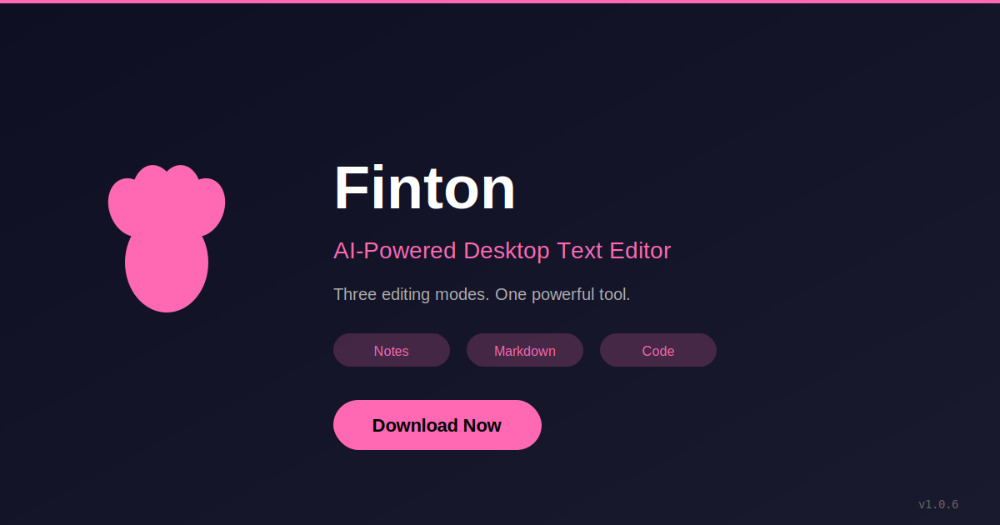

# 📸 Finton Screenshots

Professional screenshots and marketing assets for Finton.

## 🎨 Hero Image

**hero.svg** - Main marketing banner (1200x630) for social media and GitHub

## 📷 Application Screenshots

### Required Screenshots (To Be Added)

Take screenshots at 2560x1440 resolution (Retina) for best quality:

#### 1. **dashboard.png** - Welcome Dashboard
- Shows workspace creation/opening dialog
- Clean, inviting first impression
- Highlight the paw icon in the app

#### 2. **notes-editor.png** - Rich Text Editor
- Document with formatted text, headers, lists
- Show formatting toolbar
- Include some sample content (blog post or article)
- Demonstrate WYSIWYG editing

#### 3. **markdown-editor.png** - Markdown Mode
- Split view: markdown source on left, preview on right
- Show markdown syntax highlighting
- Include code blocks, tables, or diagrams in preview
- Demonstrate live preview feature

#### 4. **code-editor.png** - Code Mode
- Syntax-highlighted code (JavaScript or Python)
- Show line numbers and Monaco editor features
- Include output panel if possible
- Demonstrate code execution feature

#### 5. **ai-assistant.png** - AI Integration
- AI prompt dialog open
- Show conversation or generation in progress
- Highlight multi-provider support (Anthropic, OpenAI, OpenRouter, Ollama)
- Demonstrate insert/replace mode options

#### 6. **settings.png** - Settings Panel
- Show AI configuration tab
- Display multiple provider options
- Clean, professional settings UI
- Show API key input (masked)

#### 7. **zen-mode.png** - Distraction-Free Mode
- Full-screen editing with minimal UI
- Show focused writing experience
- Subtle hint about ESC to exit

#### 8. **templates.png** - Template System
- Template selection dialog
- Show 2-3 example templates
- Demonstrate template organization

## 📐 Screenshot Guidelines

### Quality Standards
- ✅ **Resolution**: Minimum 2560x1440 (Retina/HiDPI)
- ✅ **Format**: PNG with transparency where appropriate
- ✅ **Content**: Use realistic, professional sample text
- ✅ **UI**: Clean workspace, no clutter
- ✅ **Theme**: Use default theme for consistency
- ✅ **Window**: Center window, standard size

### Sample Content Ideas
- **Notes**: Professional blog post about productivity
- **Markdown**: Technical documentation or README
- **Code**: Well-commented JavaScript/Python example
- **AI**: Helpful, practical AI interaction

### Capture Process
1. Set display to 2560x1440 or use Retina MacBook
2. Clear any personal data or test content
3. Use professional, realistic sample content
4. Take screenshots with **Cmd+Shift+4+Space** (macOS) for window with shadow
5. Or use **Cmd+Shift+5** for full-screen captures
6. Optimize PNGs with ImageOptim or similar

### File Naming
- Use lowercase with hyphens
- Be descriptive: `notes-editor-formatting.png`
- Add version suffix if needed: `dashboard-v1.0.6.png`

## 🎬 Optional: Screen Recordings

Consider creating short (10-15 second) GIFs showing:
- Switching between editor modes
- AI content generation
- Live markdown preview
- Code execution
- Template selection

Tools: **Kap** (macOS), **ScreenToGif** (Windows), **Peek** (Linux)

## 📱 Social Media Assets

Generate from hero.svg for different platforms:
- Twitter/X: 1200x675
- Open Graph: 1200x630 (already done)
- LinkedIn: 1200x627

---

**Note**: Screenshots show the actual application UI. Replace this note with actual screenshots as they're captured.
